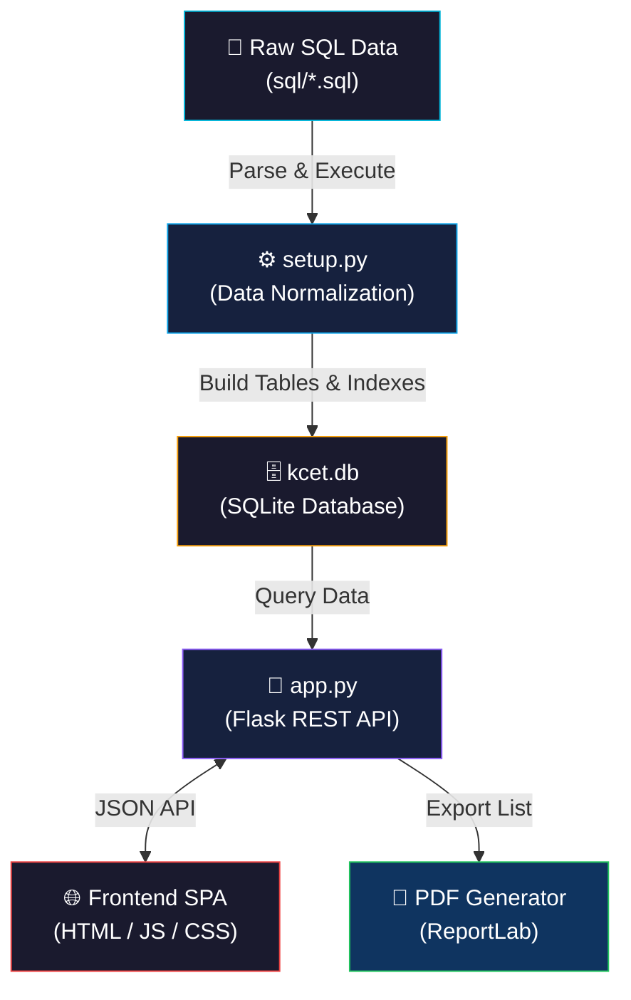

<div align="center">

<!-- ═════════════════════════════════════════════════════════════════[...]
<!--                        PROJECT HEADER                              -->
<!-- ═════════════════════════════════════════════════════════════════[...]


<br>

# KCET Option Entry Helper

<br>

[](https://python.org)
[](https://flask.palletsprojects.com)
[](https://sqlite.org)
[](https://www.reportlab.com)
[](LICENSE)

<br>

> *A smart, offline-first web tool to explore Karnataka CET engineering colleges, compare cutoff ranks, and build your personalised option entry list.*

<br>

**Built for KCET 2025 Aspirants**
*Works on any device via LAN · No internet required after setup*

<br>

</div>

<!-- ═════════════════════════════════════════════════════════════════[...]
<!--                        AT A GLANCE                                 -->
<!-- ═════════════════════════════════════════════════════════════════[...]

<div align="center">

| | |
|:---:|---|
| **🤔 PROBLEM** | Complex PDFs and thousands of cutoff rows make KCET option entry confusing and error-prone. |
| **💡 SOLUTION** | Interactive web app with smart filters, cutoff explorers, and automated PDF export for final list generation. |

`Smart Search` &nbsp;·&nbsp; `Cutoff Explorer` &nbsp;·&nbsp; `Option Builder` &nbsp;·&nbsp; `PDF Export` &nbsp;·&nbsp; `LAN Access`

</div>

---

<!-- ═════════════════════════════════════════════════════════════════[...]
<!--                      TABLE OF CONTENTS                             -->
<!-- ═════════════════════════════════════════════════════════════════[...]

<details open>
<summary><h2>📋 Table of Contents</h2></summary>

&nbsp;

| # | Section | Description |
|:-:|---------|-------------|
| 1 | [✨ Features](#-1-features) | What this tool can do |
| 2 | [🏗️ System Architecture](#️-2-system-architecture) | How the application is structured |
| 3 | [🗂️ Project Structure](#️-3-project-structure) | Codebase organization |
| 4 | [🚀 Quick Start](#-4-quick-start) | Installation & usage guide |
| 5 | [📊 Data Overview](#-5-data-overview) | Statistics about the embedded data |
| 6 | [📡 API Reference](#-6-api-reference) | Backend endpoints |
| 7 | [🤝 Contributing](#-7-contributing) | How to contribute |
| 8 | [⚠️ Disclaimer](#️-8-disclaimer) | Important notices |

&nbsp;

</details>

---

<!-- ═════════════════════════════════════════════════════════════════[...]
<!--                           FEATURES                                 -->
<!-- ═════════════════════════════════════════════════════════════════[...]

## ✨ 1. Features

| Feature | Description |
|---------|-------------|
| 🔍 **Smart Search & Filters** | Search by college name or code, filter by district, institution type, autonomous status, course, and seat category. |
| 📊 **Cutoff Explorer** | View Round 3 cutoff ranks across all 28 seat categories for every course. |
| 📝 **Option List Builder** | Add courses to your personal option list with drag-to-reorder priorities. |
| 📄 **PDF Export** | Export your final option list as a professionally formatted landscape PDF. |
| 📱 **Multi-Device Access** | Run on your PC and access from any phone or tablet on the same Wi-Fi. |
| 🏫 **Comprehensive Data** | Complete data for 237 Government, Aided, Private, Deemed & University colleges. |
| 🎨 **Responsive UI** | Clean, modern design that adapts to desktop, tablet, and phone screens. |

---

<!-- ═════════════════════════════════════════════════════════════════[...]
<!--                     SYSTEM ARCHITECTURE                            -->
<!-- ═════════════════════════════════════════════════════════════════[...]

## 🏗️ 2. System Architecture

The application is built on a lightweight, offline-first architecture prioritizing speed and reliability:

### Architecture Diagram



### Component Details

| Component | Description |
|-----------|-------------|
| **Database Builder** | `setup.py` reads static SQL files, creates `kcet.db`, and normalises wide-format cutoff data into a highly queryable tall table structure. |
| **Backend API** | A lightweight Flask server (`app.py`) exposing RESTful endpoints for searching, filtering, and managing user options. |
| **Frontend UI** | A responsive, single-page application (SPA) built with vanilla JS and CSS, communicating with the backend via AJAX. |

---

<!-- ═════════════════════════════════════════════════════════════════[...]
<!--                     PROJECT STRUCTURE                              -->
<!-- ═════════════════════════════════════════════════════════════════[...]

## 🗂️ 3. Project Structure

```text
CET_OptionEntry_Helper/
│
├── 📄 app.py                           # Flask backend — API routes & PDF export
├── ⚙️ setup.py                         # One-time DB builder (SQL → SQLite)
│
├── 🌐 static/                          # Frontend assets (served by Flask)
│   ├── 📄 index.html                   # Single-page application shell
│   ├── 📜 app.js                       # Client-side logic & API integration
│   └── 🎨 style.css                    # Responsive styling
│
├── 💾 sql/                             # Raw data sources
│   ├── 📄 kcet_schema_sqlite.sql       # Database schema and views
│   ├── 📄 districts.sql                # Karnataka districts data
│   ├── 📄 college_district_mapping.sql # College ↔ District mapping
│   ├── 📄 kcet_cutoffs.sql             # Wide-format cutoff records
│   └── 📄 *_colleges_with_codes.sql    # Categorized college datasets
│
├── 📋 .gitignore                       # Excludes kcet.db, __pycache__, *.pdf
├── ⚖️ LICENSE                          # MIT License
└── 📖 README.md                        # Project documentation
```

---

<!-- ═════════════════════════════════════════════════════════════════[...]
<!--                       QUICK START                                  -->
<!-- ═════════════════════════════════════════════════════════════════[...]

## 🚀 4. Quick Start

### Prerequisites

| Requirement | Version | Installation |
|-------------|---------|--------------|
| Python | 3.10+ | [python.org](https://python.org) |
| Flask | 3.x | `pip install flask` |
| ReportLab | Latest | `pip install reportlab` |

### Installation

```bash
# 1. Clone the repository
git clone https://github.com/<your-username>/CET_OptionEntry_Helper.git
cd CET_OptionEntry_Helper

# 2. Install dependencies
pip install flask reportlab

# 3. Build the database (one-time setup, takes ~3 seconds)
python setup.py
```

### Usage

```bash
# Launch the Flask server
python app.py
```

### Accessing the Application

| Access Mode | URL |
|-------------|-----|
| 💻 **Local PC** | `http://localhost:5000` |
| 📱 **Mobile/LAN** | `http://<your-LAN-IP>:5000` |

> **Note:** The exact LAN IP will be printed in your terminal when starting `app.py`. Ensure your phone and PC are on the same Wi-Fi network.

---

<!-- ═════════════════════════════════════════════════════════════════[...]
<!--                          DATA OVERVIEW                             -->
<!-- ═════════════════════════════════════════════════════════════════[...]

## 📊 5. Data Overview

<div align="center">

| Metric | Count |
|--------|:---:|
| **Districts** | 31 |
| **Colleges** | 237 |
| **Unique Courses** | 158 |
| **Seat Categories** | 28 |
| **Cutoff Records** | 10,592 |
| **Source Data** | UGCET-2025 · Round 3 · Rest of Karnataka |

### Data Sources

The cutoff data is sourced from official KEA documents:

- 📄 [KCET 2026 Seat Allocation (KEA Official)](https://cetonline.karnataka.gov.in/keawebentry456/ugcet2026/Eng_seatkannada.pdf)
- 📄 [KCET Round 3 Cutoff Data (CollegeDunia Reference)](https://image-static.collegedunia.com/public/image/KCET_Round_3_Cutoff_f4bf07a0b55522f47bdd70ed12d3ca4a.pdf)

</div>

---

<!-- ═════════════════════════════════════════════════════════════════[...]
<!--                          API REFERENCE                             -->
<!-- ═════════════════════════════════════════════════════════════════[...]

## 📡 6. API Reference

### Data & Search Endpoints

| Method | Endpoint | Description |
|--------|----------|-------------|
| `GET` | `/api/filters` | Fetches dropdown options (districts, types, courses, categories) |
| `GET` | `/api/colleges` | Searches & filters colleges (supports pagination) |
| `GET` | `/api/college/<id>/cutoffs`| Returns the full cutoff table for a specific college |
| `GET` | `/api/stats` | General database statistics |

### Option Management Endpoints

| Method | Endpoint | Description |
|--------|----------|-------------|
| `GET` | `/api/options` | Retrieves user's saved option list ordered by priority |
| `POST` | `/api/options` | Adds a college-course pair to the option list |
| `DELETE` | `/api/options/<id>` | Removes an option and re-sequences priorities |
| `PUT` | `/api/options/reorder` | Reorders option priorities |
| `PATCH` | `/api/options/<id>/notes` | Updates custom notes for an option |

### Utilities

| Method | Endpoint | Description |
|--------|----------|-------------|
| `GET` | `/api/export-pdf` | Downloads the final option list as a formatted PDF |
| `GET` | `/api/server-info` | Returns the LAN URL for cross-device sharing |

---

<!-- ═════════════════════════════════════════════════════════════════[...]
<!--                        CONTRIBUTING                                -->
<!-- ═════════════════════════════════════════════════════════════════[...]

## 🤝 7. Contributing

Contributions are welcome! Follow these steps:

```bash
# 1. Fork the repository
# 2. Create a feature branch
git checkout -b feature/NewFeature
# 3. Commit your changes
git commit -m 'Add NewFeature'
# 4. Push to the branch
git push origin feature/NewFeature
# 5. Open a Pull Request
```

### Feature Ideas
- 📌 Add Hyderabad-Karnataka region cutoff data
- 📅 Multi-round comparison (Round 1 vs 2 vs 3)
- 📊 Rank trend charts and visualisations

---

<!-- ═════════════════════════════════════════════════════════════════[...]
<!--                           DISCLAIMER                               -->
<!-- ═════════════════════════════════════════════════════════════════[...]

## ⚠️ 8. Disclaimer

> This tool is an **unofficial helper** built for personal use. The cutoff data is sourced from publicly available KEA documents. Always verify data against the [official KEA website](https://cetonline.karnataka.gov.in).

---

<!-- ═════════════════════════════════════════════════════════════════[...]
<!--                           FOOTER                                   -->
<!-- ═════════════════════════════════════════════════════════════════[...]

<div align="center">

<br>

[]()
[]()

<br>

**Made for KCET Aspirants in Karnataka**

*If you find this work useful, please consider giving it a* ⭐

</div>
